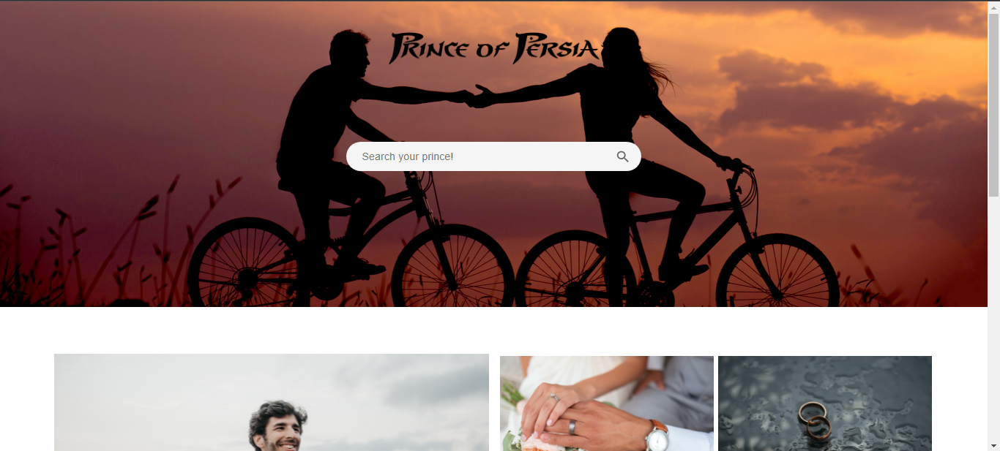
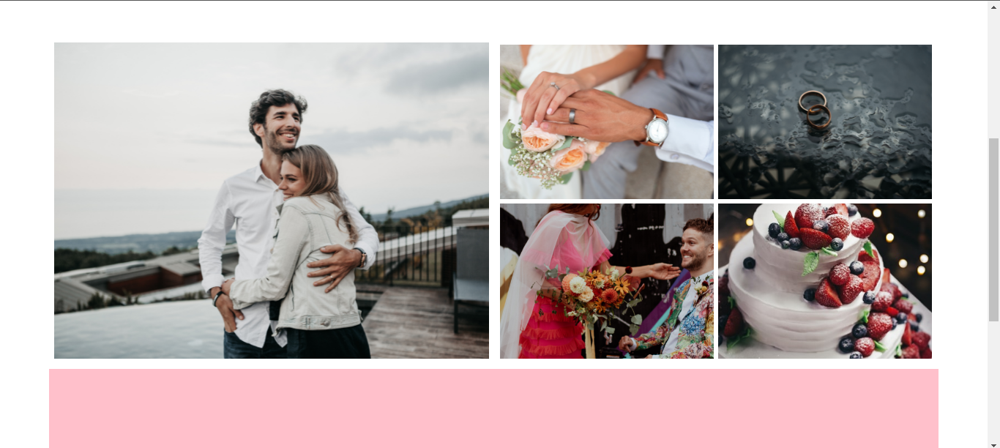

# Prince of Persia
> I developed this website as a project for Codecademy's full-stack engineer course. it ended up being like a social network. I will develope it in the near future.

## Table of Contents
* [General Info](#general-information)
* [Technologies Used](#technologies-used)
* [Features](#features)
* [Screenshots](#screenshots)
* [Setup](#setup)
* [Usage](#usage)
* [Project Status](#project-status)
* [Room for Improvement](#room-for-improvement)
* [Acknowledgements](#acknowledgements)
* [Contact](#contact)
<!-- * [License](#license) -->

## General Information
It's going to a social network designed for women who need to find a husband.

## Technologies Used
- HTML
- CSS

## Screenshots

## Project Status
Project is: _in progress_

## Room for Improvement
Room for improvement:
- Responsive behaviour
- Addition of some functionality
- Being interactive
- Addition of user area

To do:
- Adding Javascript
- Flexbox and grid styling developemnt
- Addition of a database

## Acknowledgements
Special thanks to Codecademy's educational materials.

## Contact
Created by [@hiradfazeli](https://hiradfazeli.github.io/) - feel free to contact me!
